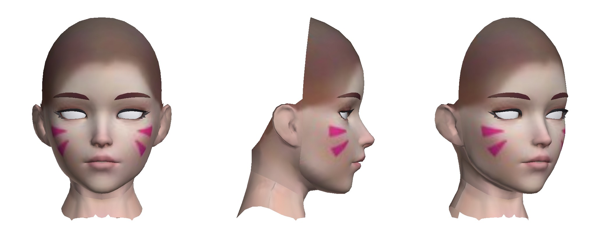
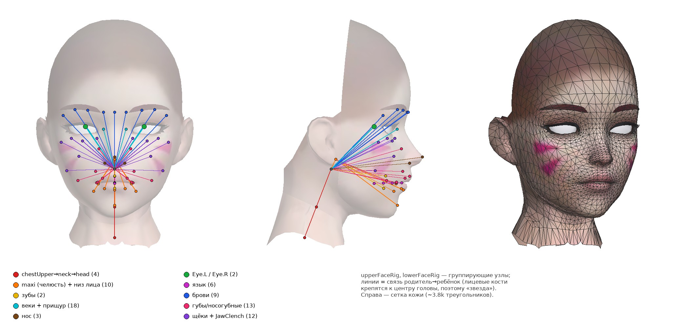
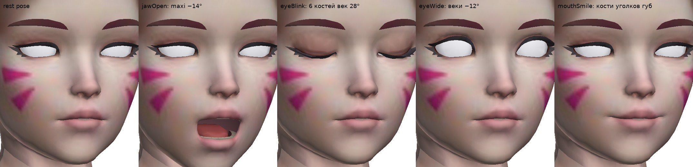
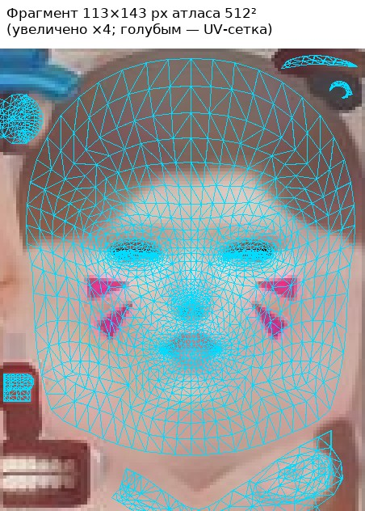
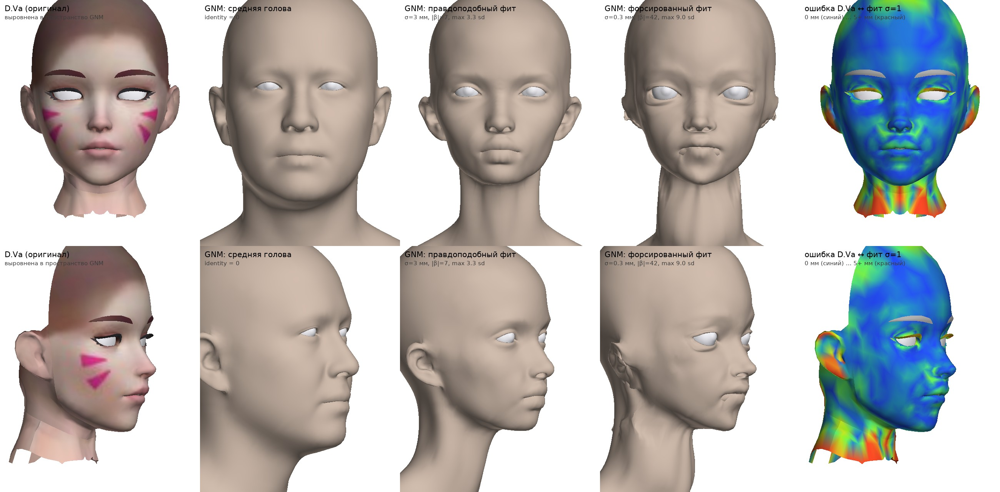
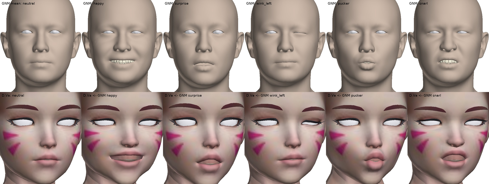

# Голова D.Va (`DvaGolovaOK_2_lite.glb`): скелет, готовность к ARKit, перенос в Google GNM

> Все цифры и картинки ниже получены скриптами из [`tools/`](../tools/README.md). Их можно перезапустить.
> Отчёт — от 25.09.2026, для GNM Head v3.0 (коммит `f689550` в репозитории google/GNM).

## Коротко

| Вопрос | Ответ |
|---|---|
| **Какой скелет** | 80 костей в одном скине. Это лицевой риг **DAZ Genesis 8 Female**: урезанный, с блендеровскими именами `.L/.R`, челюсть называется `maxi`, у языка своя цепочка. Риг рабочий: bind pose = rest pose, до 4 весов на вершину. Челюсть, моргание, «широкие глаза» и улыбка костями работают чисто (рис. 3). |
| **Готова ли к ARKit** | **Нет.** В файле **0 из 52** blendshape (морф-таргетов нет совсем). Хорошая новость: риг покрывает все зоны лица, так что 52 формы можно **запечь из поз костей** примерно за 1–3 дня работы в Blender. Ещё надо починить глаза (белые сферы без радужки, битый материал). Сетка (~2.2k вершин) и текстура лица (~110×140 px) — узкие места для крупного плана. |
| **Перенести в GNM** | Подогнать GNM «примерно» легко: это часы, скрипт есть. Но **точно скопировать форму через параметры GNM нельзя**: у D.Va стилизованные глаза (~×1.3 шире человеческих), маленький рот и короткая средняя зона лица. Всё это вне «человеческого» пространства модели. Точная копия — это GNM + residual-слой + перепечка текстуры, порядка **1–3 недель**. Мимику GNM на сетку D.Va перенести можно: для рта это получилось, веки же закрываются только на 66%. Готового ARKit у GNM нет. **Для задачи «ARKit» GNM — это крюк.** |

---

## 1. Что в файле

| | |
|---|---|
| Формат | glTF 2.0 binary, экспорт из Blender 5.2 (Khronos glTF I/O v5.2.39), 454 КБ. `DvaGolovaOK_2_lite.json` и `_base64.txt` — тот же GLB в base64. |
| Узлы | 84 узла: 80 костей, объект-арматура `Dva_Rig` → `Root`, 2 меш-объекта. |
| Меши | **Кожа** (`Genesis8Female.008`, примитив 0): 2204 вершины / 3826 треугольников. Сюда входят брови (2 отдельные карточки, привязаны к костям бровей) и язык. **Зубы** (тот же меш, примитив 1): 226 / 326. **Глаза** (отдельный объект): 194 / 352, две сферы r = 1.73 см. |
| Морф-таргеты | **нет** |
| Материалы | кожа (baseColor 512² JPEG + normal 512² JPEG), зубы (256×512 PNG), глаза (**без текстуры и без блока PBR**). Используются расширения `KHR_materials_clearcoat/specular/ior`. |
| Мусор | `COLOR_0..2` — константные белые вершинные цвета (≈40 КБ), можно удалить. |
| Единицы / оси | метры; +Y вверх, +Z вперёд (в сторону взгляда), +X — **левая** сторона персонажа. Габариты 14.5 × 21.2 × 14.4 см. Начало координат у основания шеи. |
| Геометрия | децимированная сетка G8: топология Genesis 8 потеряна. **Затылок открыт** (срез переходит в шею), волос нет. |



## 2. Скелет

```
Dva_Rig
└─ Root
   ├─ (меши: Body Eyes, голова)
   └─ chestUpper → neckLower → neckUpper → head
                                          ├─ Eye.L, Eye.R                      глазные яблоки (жёстко, 1 кость)
                                          ├─ upperTeeth                        верхние зубы (жёстко)
                                          ├─ upperFaceRig ── 55 костей верхней половины лица
                                          └─ maxi  (= lowerJaw в DAZ, шарнир челюсти ≈ (0, 8.3, 0.2) см)
                                             ├─ lowerFaceRig ── Chin, LipLowerInner.L/R, LipLowerMiddle,
                                             │                  LipLowerOuter.L/R, NasolabialLower.L/R
                                             ├─ lowerTeeth                     нижние зубы (жёстко)
                                             └─ tongue_control → tongue_5 → tongue044 → tongue033 → tongue022 → tongue011
```

| Группа | Кости | Кол-во |
|---|---|---|
| Шея / голова | chestUpper, neckLower, neckUpper, head | 4 |
| Глаза | Eye.L, Eye.R | 2 |
| Брови | BrowInner, BrowMid, BrowOuter, BrowOuter.001 (×2 стороны), CenterBrow | 9 |
| Веки + прищур | EyelidUpper / UpperInner / UpperOuter / Inner / Outer / Lower / LowerInner / LowerOuter (×2), SquintInner (×2) | 18 |
| Щёки | CheekUpper, CheekLower, JawClench + .001–.003 (×2) | 12 |
| Нос | Nose, Nostril.L/R | 3 |
| Верхняя губа, уголки, носогубка | LipUpperMiddle, LipUpperInner/Outer, LipCorner, LipNasolabialCrease, NasolabialUpper, NasolabialMouthCorner (×2) | 13 |
| Челюсть + нижняя губа | maxi, lowerFaceRig, Chin, LipLowerInner/Outer (×2), LipLowerMiddle, NasolabialLower (×2) | 10 |
| Язык | tongue_control, tongue_5, tongue044, tongue033, tongue022, tongue011 | 6 |
| Зубы | upperTeeth, lowerTeeth | 2 |
| Группирующий узел | upperFaceRig (у него тоже есть небольшие веса) | 1 |

**Особенности**

- **Bind pose совпадает с rest pose** (|W·IBM − I| < 1e-6). Веса нормированы, до 4 влияний на вершину. Деформируют 76 костей из 80. Без весов остались `lowerFaceRig`, `tongue_control`, `tongue_5`, `tongue033`.
- Лицевые кости — дети `upperFaceRig` и `lowerFaceRig`, которые стоят в центре головы. Поэтому на схеме скелет выглядит как «звезда» — это нормальная конвенция DAZ.
- **Цепочка языка инвертирована**: идёт от кончика (`tongue_5`/`tongue044`, z = 6.3 см) к корню (`tongue011`, z = 3.7 см). Для `tongueOut` достаточно двигать `tongue_control`.
- По сравнению со стоковым ригом G8 части костей нет: ушей, `MidNoseBridge`, `SquintOuter`, `LipBelowNose`, `LipBelow`, `BelowJaw`. Зато есть дубли `JawClench.001–.003` и `BrowOuter.001`. Видимо, риг чистили и дорабатывали в Blender.
- Позы проверены программно (LBS по данным файла): `maxi` −14° по локальной X открывает рот вместе с нижними зубами и языком; 3 кости верхнего века (с каждой стороны) на +28° закрывают глаз на 99%; −12° дают «широкие глаза»; сдвиг костей уголков губ даёт улыбку.




## 3. Готовность к ARKit (52 blendshapes)

ARKit (`ARFaceAnchor.blendShapes`) выдаёт 52 коэффициента 0…1, позу головы и трансформы глаз. Модель должна уметь воспроизвести эти 52 формы. Обычно это морф-таргеты с точными именами (`eyeBlinkLeft`, `jawOpen`, …); как вариант — ретаргет коэффициентов на кости в рантайме.

| Требование | Статус |
|---|---|
| 52 морф-таргета с именами ARKit | ❌ **0/52**, морфов нет вообще (`python tools/inspect_glb.py …` выводит список недостающих) |
| Риг, которым эти формы можно сделать | ✅ все зоны покрыты (таблица ниже) |
| Оси / единицы | ✅ метры; +X влево, +Y вверх, +Z к зрителю — совпадает с системой координат лица ARKit |
| Масштаб | ⚠️ ≈0.9 от реального: межзрачковое 54 мм, подгонка к GNM дала масштаб ×1.10. Pivot у основания шеи — при креплении к якорю лица нужен сдвиг. |
| Глаза | ❌ белые сферы без радужки и зрачка → `eyeLook*` просто не будет видно. У материала нет `pbrMetallicRoughness` → по спецификации metallic = 1, и глаза рендерятся серыми или тёмными. |
| Веки | ✅ закрываются полностью (99%) |
| Зубы / язык | ✅ есть и на костях |
| Плотность сетки | ⚠️ 2.2k вершин, децимация: у губ мало колец, поэтому `mouthRoll*`, `mouthPress*`, `mouthFunnel`, `mouthDimple*` выйдут грубоватыми |
| Текстура лица | ⚠️ лицо занимает ≈110×140 px в атласе тела 512² (рис. 4) — на крупном плане будет мыло |
| Затылок / волосы | ⚠️ затылок открыт — для AR-маски это ОК, для аватара нужны волосы или шапка |



### Какие кости дают какие формы ARKit

| ARKit | Кости рига |
|---|---|
| `eyeBlink*`, `eyeWide*` | EyelidUpper, EyelidUpperInner, EyelidUpperOuter (+ Eyelid Lower*) |
| `eyeSquint*`, `cheekSquint*` | EyelidLower*, SquintInner, CheekUpper |
| `eyeLook*` (8) | Eye.L/R. Проще брать трансформы глаз из ARKit напрямую. |
| `jawOpen`, `jawLeft/Right`, `jawForward` | maxi (поворот по X / Y, сдвиг по Z) |
| `mouthSmile*`, `mouthFrown*`, `mouthDimple*`, `mouthStretch*` | LipCorner, LipUpperOuter, LipLowerOuter, NasolabialMouthCorner, CheekLower |
| `mouthPucker`, `mouthFunnel`, `mouthRoll*`, `mouthPress*`, `mouthClose` | LipUpper*, LipLower*, LipCorner (+ maxi для `mouthClose`) |
| `mouthShrugLower/Upper` | Chin / LipUpper* |
| `mouthLeft/Right`, `mouthUpperUp*`, `mouthLowerDown*` | губные кости, NasolabialUpper |
| `browDown*`, `browInnerUp`, `browOuterUp*` | BrowInner, BrowMid, BrowOuter(.001), CenterBrow (брови-карточки к ним привязаны) |
| `cheekPuff` | CheekLower, JawClench |
| `noseSneer*` | Nostril, NasolabialUpper, Nose |
| `tongueOut` | tongue_control (+ цепочка) |

### Как довести до ARKit (рекомендуемый путь)

1. Импортировать GLB в Blender. Для каждой из 52 форм поставить позу костей и в модификаторе Armature выбрать **Save as Shape Key**. Ключ назвать точно по ARKit (`jawOpen`, `mouthSmileLeft`, …) и сбросить позу. Правые формы удобно делать через Paste X-Flipped. Сетка после децимации несимметрична, поэтому зеркалить лучше позы, а не шейпы.
2. Где костей не хватает (`mouthRoll*`, `mouthFunnel`, `mouthPress*`, `cheekPuff`), доскульптить шейп. Зубы и язык лежат в том же меше, что и кожа, поэтому `jawOpen` захватит их автоматически. Глаза — отдельный объект: их лучше вращать костями по трансформам глаз ARKit.
3. Починить глаза: радужка и зрачок (текстура или отдельная геометрия), нормальный PBR-материал.
4. По желанию — перепечь лицо в текстуру 1–2k (если есть исходник G8) и удалить `COLOR_0..2`.
5. Экспортировать glTF с Shape Keys и проверить `python tools/inspect_glb.py out.glb` — должно быть «Найдено 52/52».
6. Проверить на реальных данных: Live Link Face, ARKit-приложение или MediaPipe Face Landmarker в браузере — он отдаёт те же 52 имени.

Оценка: **1–3 рабочих дня** для человека, уверенно работающего в Blender. Коммерческие инструменты (Faceit для Blender, сервис Polywink) делают 52 формы полуавтоматически, но ручная доводка всё равно нужна. Альтернатива без шейпов — рантайм-ретаргет «коэффициент ARKit → поза костей» (Unity/Unreal/three.js): ассетов меньше, кода больше.

## 4. Перенос в Google GNM («genome»)

### 4.1 Что такое GNM Head

[google/GNM](https://github.com/google/GNM) ([статья arXiv:2607.23687](https://arxiv.org/abs/2607.23687)) — параметрическая модель **реальной человеческой** головы под Apache-2.0. Формула: `V = T + β·I + φ·E` плюс 4 сустава.

- Сетка v3.0: **17 821 вершина / 35 324 треугольника** (кожа, глаза, зубы и дёсны, язык). Единицы — метры, оси те же, что в glTF.
- **Identity β: 253** параметра = 170 голова + 3 глаза + 80 зубы.
- **Expression φ: 383** параметра = 100 левый глаз + 100 правый + 150 низ лица + 32 язык + 1 зрачок. Это **региональный PCA, а не именованные шейпы**. Отдельно есть «semantic sampler» на 20 классов (happy, surprise, wink, pucker…).
- Суставы: neck, head, 2 глаза. **Кости челюсти нет** — открытие рта сидит внутри PCA выражений.
- В репозитории **нет** подгонки к произвольной сетке (projection только для сеток в топологии GNM) и **нет ARKit-маппинга**. Сообщество закрывает это приближённо: [gnm-maya](https://github.com/enriquevelmai/gnm-maya) печёт ARKit-52 из семантических форм × процедурные маски; [GNM Studio](https://github.com/Saganaki22/GNM-Studio) сводит 52 коэффициента MediaPipe к 20 семантическим морфам.
- Размеры: полный базис выражений ≈ **82 МБ** float32. 52 формы на сетке GNM ≈ 11 МБ, те же 52 формы на сетке D.Va ≈ 1.5 МБ.

«Перенести голову в GNM» может означать три разные задачи:

- **A.** Найти identity GNM, похожую на D.Va («скопировать форму в геном»).
- **B.** Сделать точную копию D.Va в топологии GNM.
- **C.** Оставить сетку D.Va и взять у GNM только мимику.

Ниже проверены A и C.

### 4.2 Эксперимент A: подгонка identity (β) к D.Va

Метод (`tools/experiments/fit_gnm.py`):

- 8 ориентиров: уголки глаз, уголки рта, кончик носа, стомион → подобие (Umeyama).
- Затем 14 итераций двустороннего ICP. На каждой — регуляризованный МНК по 170 коэффициентам головы и пересчёт подобия.
- Используется только видимая внешняя поверхность D.Va; соответствия у среза шеи и затылка отбрасываются.
- σ — «допуск шума»: чем меньше σ, тем сильнее фит подгоняется ценой неправдоподобных β.

Размеры даны в масштабе GNM (D.Va ×1.10). «Лицо» = вершины D.Va, ближайший треугольник GNM которых входит в `hockey_mask`.

| | σ = 3 мм («правдоподобный») | σ = 1 мм | σ = 0.3 мм («форсированный») |
|---|---|---|---|
| ‖β‖ (у случайного человека ≈ 13) | 7.0 | 16.5 | 42.4 |
| max \|βᵢ\| / сколько \|βᵢ\| > 3 sd | 3.3 / 1 | 3.8 / 7 | 9.0 / 60 |
| Отклонение поверхности лица: среднее / медиана / p95, мм | 1.02 / 0.67 / 3.24 | 0.73 / 0.45 / 2.76 | 0.80 / 0.49 / 2.95 |
| Ширина глазной щели: фит / D.Va, мм | 28.0 / 40.8 | 30.9 / 41.3 | 33.7 / 41.4 |
| Ширина рта: фит / D.Va, мм | 41.4 / 36.1 | 41.1 / 36.6 | 40.2 / 36.7 |
| Промах: внешний / внутренний угол глаза / уголок рта, мм | 10.3 / 5.3 / 3.2 | 7.4 / 3.7 / 2.7 | 5.7 / 2.8 / 2.3 |



**Вывод по A.**

- Общую форму черепа, лба, щёк и носа GNM ловит до ~1 мм: сама голова «человеческая».
- Стилизацию не ловит. Глаз D.Va шире человеческого в ~1.3 раза, глазное яблоко тоже крупнее: r ≈ 19 мм против 14.5 мм у GNM. Рот меньше, средняя зона лица короче.
- Даже форсированный фит, где 60 компонент уходят за 3 sd, не дотягивает глаза (промах 5.7 мм) и превращает лицо в uncanny (4-я колонка).
- Итог: **через параметры получится «реалистичная кузина» D.Va, а не она сама.** Для точной копии (вариант B) поверх β нужен per-vertex residual. Это нежёсткая регистрация GNM→D.Va плюс отдельно глаза, зубы и язык, перепечка текстуры в UV GNM и материалы. Тогда это уже не «identity GNM», а сетка GNM со своими смещениями.

### 4.3 Эксперимент C: мимика GNM → сетка D.Va

Метод (`tools/experiments/gnm_figures.py`):

- Каждая вершина D.Va привязывается барицентрически к ближайшей точке фита σ = 1.
- Дельта выражения GNM интерполируется и возвращается в систему D.Va.
- Язык и нижние зубы повторяют жёсткое движение нижних зубов GNM. Глазные яблоки неподвижны.
- Выражения сгенерированы semantic sampler'ом GNM (numpy-порт, без TensorFlow).



- **Рот переносится правдоподобно** (happy, surprise, pucker, snarl), но только после того, как зона рта разделена на верх и низ. На D.Va — по весам челюсти, на GNM — по группам `upper_lip`/`lower_lip`. Наивный closest-point рвёт губы: [пример](img/06_gnm_expr_transfer_naive.jpg).
- **Веки — нет.** `wink_left` закрывает глаз D.Va только на **66%** (щель 9.5 → 3.2 мм): ход века GNM рассчитан на человеческий глаз. Для сравнения, собственные кости век D.Va закрывают его на 99%. Нужны корректоры или масштабирование дельт в зоне глаз.
- ARKit-семантики у GNM нет. Чтобы получить 52 формы таким путём, их надо сначала собрать на GNM (своими масками или взять у gnm-maya), а потом переносить.

### 4.4 Сложность вариантов

| Вариант | Что входит | Оценка трудоёмкости | Результат |
|---|---|---|---|
| **A.** «Человеческая» D.Va в GNM (только β) | подгонка (скрипт уже есть) | часы | реалистичная похожая голова, не D.Va |
| **B.** Точная копия в топологии GNM | β + нежёсткая регистрация + residual; глаза (сферы ×1.3), зубы, язык; перепечка текстуры в UV GNM; материалы; ARKit-формы всё равно делать | **1–3 недели** + работа художника по глазам | D.Va на сетке 17.8k вершин с полным затылком; мимика GNM годится для низа лица, веки надо корректировать |
| **C.** Мимика GNM → сетка D.Va | подгонка + соответствия с разделением губ + корректоры век + сборка ARKit-смыслов | несколько дней – 2 недели | «data-driven» формы рта на исходной лёгкой сетке |
| *Для сравнения: ARKit через кости D.Va* | 52 позы → shape keys + починка глаз | **1–3 дня** | готовая к ARKit модель |

### 4.5 Рекомендация

- **Для ARKit GNM не нужен**: 52 формы быстрее и чище запечь из собственного рига D.Va (раздел 3).
- GNM имеет смысл, если нужны параметрические человеческие головы, полная голова с затылком или реалистичные деформации рта как донор. Для последнего подходит вариант C выборочно, например только формы рта.
- «Скопировать форму в геном» точно нельзя — только приближённо, или с residual-слоем (вариант B).

## 5. Лицензии (важно при публикации)

- **GNM** — Apache-2.0: можно в коммерции, с сохранением лицензии и NOTICE.
- **Сетка и текстуры на основе Genesis 8** — контент DAZ. Использование 3D-данных, в том числе производных, в интерактивных приложениях требует Interactive License на каждый использованный продукт: базовая фигура, морфы, текстуры ([DAZ Help](https://helpdaz.zendesk.com/hc/en-us/articles/207532343-What-can-I-use-Daz-3D-figures-for-legally-), [форум DAZ](https://www.daz3d.com/forums/discussion/721771/answered-cost-for-interactive-license-for-original-genesis-figure)).
- **D.Va** — персонаж Blizzard (Overwatch). Для публичного или коммерческого использования фан-модели нужны права.

## 6. Как воспроизвести

См. [`tools/README.md`](../tools/README.md). `tools/inspect_glb.py` — только numpy, выводит скелет, веса, морфы и проверку ARKit. `tools/experiments/run_all.sh` перерисовывает все картинки отчёта; нужен клон GNM, прогон занимает ~2 мин.
